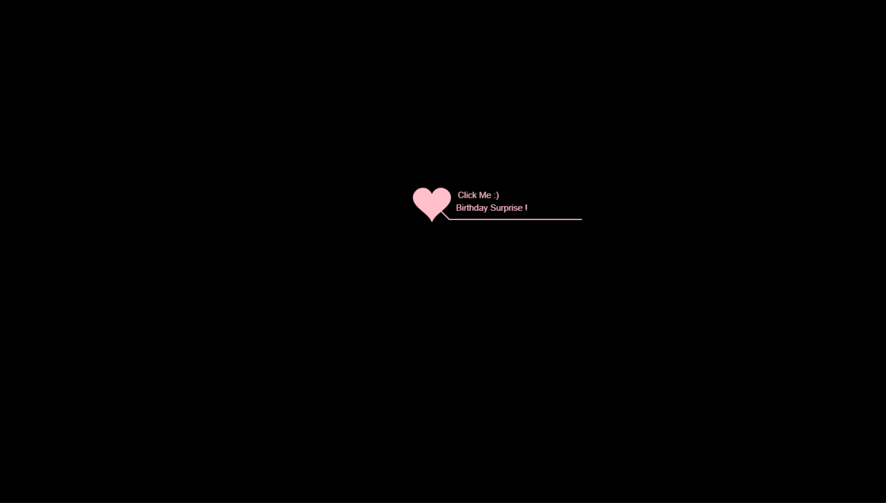
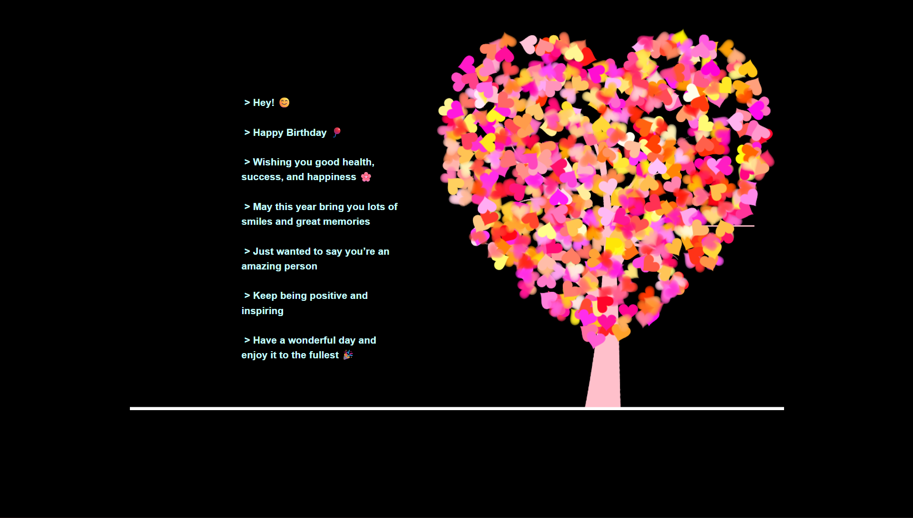

<div align="center">

<!-- ╔══════════════════════════════════════════════════════════════╗ -->
<!--                   ANIMATED WAVE HEADER                         -->
<!-- ╚══════════════════════════════════════════════════════════════╝ -->


<!-- ╔══════════════════════════════════════════════════════════════╗ -->
<!--                  ANIMATED TYPING TAGLINE                       -->
<!-- ╚══════════════════════════════════════════════════════════════╝ -->


<br/>

<!-- CTA BUTTONS -->
[](https://birthday-vibe.netlify.app/)
[](https://github.com/aryansengar007/Birthday-Vibe)

<br/>

<!-- ANIMATED SKILL ICONS -->


<br/><br/>


</div>

<br/>

<!-- ━━━━━━━━━━━━━━━━━━━━━━━━━━━━ WAVE DIVIDER ━━━━━━━━━━━━━━━━━━━━━━━━━━━━ -->


<br/>

<!-- HERO PREVIEWS -->
<div align="center">

[](https://birthday-vibe.netlify.app/)
[](https://birthday-vibe.netlify.app/)

*Click the preview to visit the live site ↑*

</div>

<br/>

<!-- ━━━━━━━━━━━━━━━━━━━━━━━━━━━━ WAVE DIVIDER ━━━━━━━━━━━━━━━━━━━━━━━━━━━━ -->


<br/>

## 🎂 About The Project

**Birthday Vibe** is an interactive and visually engaging birthday greeting webpage built with **HTML5, CSS3, JavaScript, jQuery, and Canvas**. It combines smooth animations, background music, and animated text to create a **memorable and emotional user experience** — bringing the magic of a birthday celebration to life in the browser.

> 🎯 A creative front-end showcase demonstrating HTML5 Canvas animation, async JS flow, and interactive UI design.

<br/>

<div align="center">

| 🌳 Animation | 🎵 Audio | ⌨️ Text | ⏱️ Live |
|:---:|:---:|:---:|:---:|
| Canvas blooming tree | Background music autoplay | Typewriter birthday message | Running time counter |

</div>

<br/>

<!-- ━━━━━━━━━━━━━━━━━━━━━━━━━━━━ WAVE DIVIDER ━━━━━━━━━━━━━━━━━━━━━━━━━━━━ -->


<br/>

## ✨ Features

<br/>

| 🎨 Visuals & Animation | 🎵 Audio & Interaction | ⚙️ Technical |
|:---|:---|:---|
| HTML5 Canvas blooming tree animation | Background music with autoplay | Asynchronous animation via **Jscex** |
| Typewriter-style animated birthday message | Click-based interaction to trigger animations | Clean, lightweight frontend architecture |
| Smooth multi-stage animation flow | User interaction for audio context unlock | ES5 JavaScript with jQuery DOM control |
| Festive, emotional visual design | Live running time counter | No heavy frameworks — zero dependencies |

<br/>

<!-- ━━━━━━━━━━━━━━━━━━━━━━━━━━━━ WAVE DIVIDER ━━━━━━━━━━━━━━━━━━━━━━━━━━━━ -->


<br/>

## 🛠️ Tech Stack

<br/>

<div align="center">


<br/><br/>

| Layer | Technology | Purpose |
|:---:|:---|:---|
| 🏗️ **Structure** | HTML5 | Semantic page layout & Canvas element |
| 🎨 **Styling** | CSS3 | Animations, layout & festive visual design |
| ⚡ **Interactivity** | JavaScript ES5 | Core logic, timers & animation control |
| 🔗 **DOM Manipulation** | jQuery | Event handling & element interaction |
| 🖼️ **Graphics** | HTML5 Canvas | Blooming tree & custom particle animations |
| 🔄 **Async Flow** | Jscex | Sequential async animation orchestration |
| 🚀 **Deployment** | Netlify | Live hosting |

</div>

<br/>

<!-- ━━━━━━━━━━━━━━━━━━━━━━━━━━━━ WAVE DIVIDER ━━━━━━━━━━━━━━━━━━━━━━━━━━━━ -->


<br/>

## 📁 Project Structure

```
Birthday-Vibe/
│
├── 📄 index.html                   ← Main entry point
│
├── 📂 css/
│   └── default.css                 ← All styles & animation rules
│
├── 📂 js/
│   ├── jquery.min.js               ← jQuery library
│   ├── function.js                 ← Core animation & timer logic
│   ├── love.js                     ← Canvas blooming tree animation
│   └── 📂 jscex/                   ← Async animation control library
│
└── 📂 assets/
    ├── 📂 audio/
    │   └── aud.mp3                 ← Background birthday music
    └── 📂 images/
        └── logo.svg                ← Site logo
```

<br/>

<!-- ━━━━━━━━━━━━━━━━━━━━━━━━━━━━ WAVE DIVIDER ━━━━━━━━━━━━━━━━━━━━━━━━━━━━ -->


<br/>

## 🚀 How to Run

**1. Clone the repository**

```bash
git clone https://github.com/aryansengar007/Birthday-Vibe.git
cd Birthday-Vibe
```

**2. Open in your browser**

```bash
# Simply open directly:
open index.html

# Or use VS Code Live Server for best experience:
# Right-click index.html → "Open with Live Server"
```

> ✅ Chrome or Firefox recommended for best Canvas & audio performance.

<br/>

<!-- ━━━━━━━━━━━━━━━━━━━━━━━━━━━━ WAVE DIVIDER ━━━━━━━━━━━━━━━━━━━━━━━━━━━━ -->


<br/>

## 🎯 Use Cases

<br/>

<div align="center">

| 🎂 Use Case | 💡 Description |
|:---:|:---|
| 🎁 Personalized Greeting | Send as a custom birthday webpage link to friends or family |
| 🎨 Animation Demo | Showcase of HTML5 Canvas + async JS animation techniques |
| 📚 Learning Project | Practice Canvas API, jQuery events & async animation flow |
| 🗂️ Portfolio Piece | Demonstrates UI creativity and frontend animation skills |

</div>

<br/>

<!-- ━━━━━━━━━━━━━━━━━━━━━━━━━━━━ WAVE DIVIDER ━━━━━━━━━━━━━━━━━━━━━━━━━━━━ -->


<br/>

## 🌐 Browser Support

<div align="center">

| Browser | Support |
|:---:|:---:|
| 🟢 Google Chrome | ✅ Recommended |
| 🟠 Mozilla Firefox | ✅ Supported |

</div>

<br/>

<!-- ━━━━━━━━━━━━━━━━━━━━━━━━━━━━ WAVE DIVIDER ━━━━━━━━━━━━━━━━━━━━━━━━━━━━ -->


<br/>

## 🔮 Future Improvements

<br/>

| # | Feature | Description |
|:---:|:---|:---|
| 01 | 📱 Mobile Responsiveness | Adapt Canvas animations for touch & small screens |
| 02 | ✏️ Custom Message Input | Let users enter a personalized birthday name & message |
| 03 | 🎨 Theme Customization | Color palette & background theme selector |
| 04 | 🌐 GitHub Pages Deploy | Alternate free hosting via GitHub Pages |

<br/>

<!-- ━━━━━━━━━━━━━━━━━━━━━━━━━━━━ WAVE DIVIDER ━━━━━━━━━━━━━━━━━━━━━━━━━━━━ -->


<br/>

## 👨‍💻 Author

<div align="center">

### Aryan Sengar

🎓 **B.Tech CSE (AI & ML)** &nbsp;|&nbsp; 🌍 Gurgaon, India
&nbsp;|&nbsp; Frontend Developer & UI Enthusiast

<br/>

[](https://www.linkedin.com/in/aryan-sengar-786b96290/)
[](https://github.com/aryansengar007)

</div>

<br/>

<!-- ╔══════════════════════════════════════════════════════════════╗ -->
<!--                   ANIMATED WAVE FOOTER                         -->
<!-- ╚══════════════════════════════════════════════════════════════╝ -->


<div align="center">

© 2025 **Aryan Sengar** — All Rights Reserved. Unauthorized copying is strictly prohibited.

<br/>

*If you found this project fun or helpful, consider leaving a* ⭐ *— it means a lot!*

</div>
